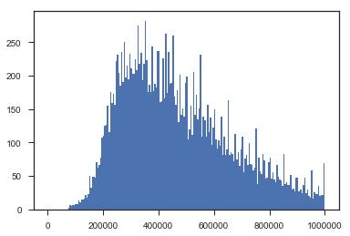
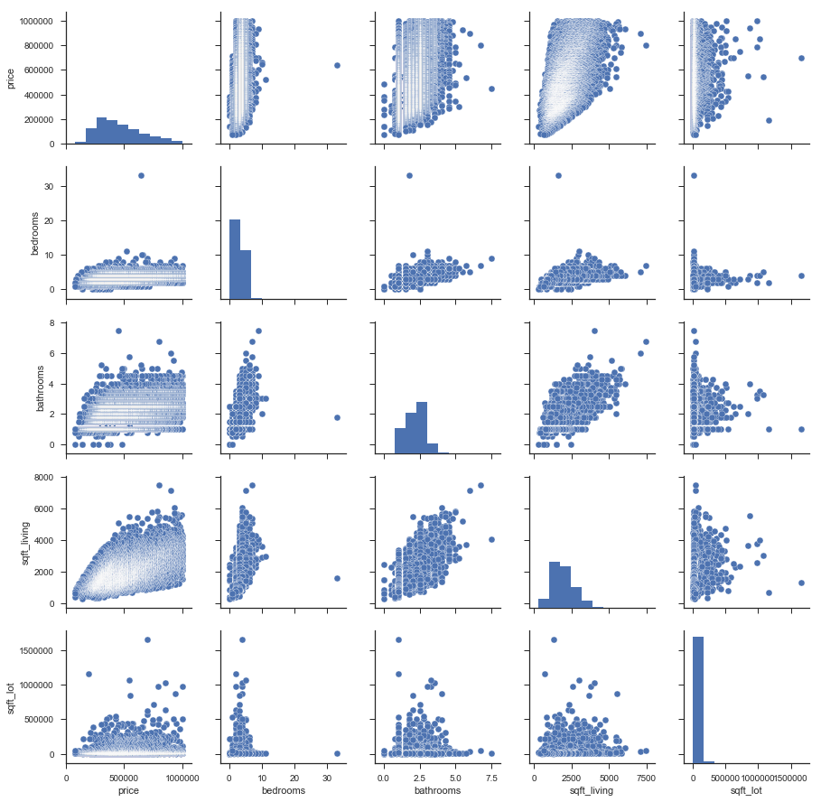
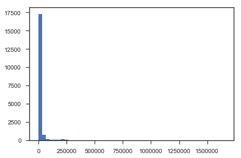
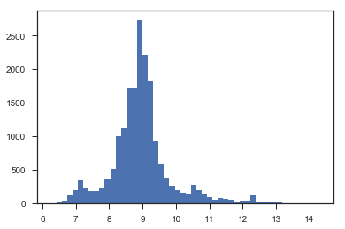

```python
import pandas as pd
data = pd.read_csv('kc_house_data.csv')
data.info()
```

    <class 'pandas.core.frame.DataFrame'>
    RangeIndex: 21613 entries, 0 to 21612
    Data columns (total 21 columns):
    id               21613 non-null int64
    date             21613 non-null object
    price            21613 non-null float64
    bedrooms         21613 non-null int64
    bathrooms        21613 non-null float64
    sqft_living      21613 non-null int64
    sqft_lot         21613 non-null int64
    floors           21613 non-null float64
    waterfront       21613 non-null int64
    view             21613 non-null int64
    condition        21613 non-null int64
    grade            21613 non-null int64
    sqft_above       21613 non-null int64
    sqft_basement    21613 non-null int64
    yr_built         21613 non-null int64
    yr_renovated     21613 non-null int64
    zipcode          21613 non-null int64
    lat              21613 non-null float64
    long             21613 non-null float64
    sqft_living15    21613 non-null int64
    sqft_lot15       21613 non-null int64
    dtypes: float64(5), int64(15), object(1)
    memory usage: 3.5+ MB


```python
X = data[['bedrooms', 'bathrooms', 'condition', 'sqft_living',
          'sqft_lot', 'floors', 'waterfront']]
y = data['price']
```


```python
from sklearn.model_selection import train_test_split
```


```python
X_train, X_test, y_train, y_test = train_test_split(X, y, test_size = .4, random_state = 22)
```


```python
from sklearn.linear_model import LinearRegression
```


```python
linear = LinearRegression(fit_intercept = True)
```


```python
l = linear.fit(X_train, y_train)
```


```python
l.score(X_train, y_train)
```


    0.5575888848317304


```python
l.score(X_test, y_test)
```


    0.5396319424054776


```python
from sklearn.linear_model import Ridge
```


```python
ridge = Ridge(fit_intercept = True, random_state = 22)
```


```python
r = ridge.fit(X_train, y_train)
```


```python
r.score(X_train, y_train)
```


    0.5575851799335152


```python
r.score(X_test, y_test)
```


    0.5396708834683759


```python
from sklearn.linear_model import Lasso
```


```python
lasso = Lasso(fit_intercept = True, random_state = 22)
```


```python
ls = lasso.fit(X_train, y_train)
```


```python
ls.score(X_train, y_train)
```


    0.5575888837771769


```python
ls.score(X_test, y_test)
```


    0.5396326687615447


```python
from sklearn.metrics import mean_squared_error
```


```python
mean_squared_error(y_train, l.predict(X_train)) ** .5
```


    243672.80789391286


```python
mean_squared_error(y_test, l.predict(X_test)) ** .5
```


    250268.16332328354


```python
mean_squared_error(y_train, r.predict(X_train)) ** .5
```


    243673.8281904539


```python
mean_squared_error(y_test, r.predict(X_test)) ** .5
```


    250257.57840733754


```python
mean_squared_error(y_train, ls.predict(X_train)) ** .5
```


    243672.8081843283


```python
mean_squared_error(y_test, ls.predict(X_test)) ** .5
```


    250267.9658900912


```python
data.info()
```

    <class 'pandas.core.frame.DataFrame'>
    RangeIndex: 21613 entries, 0 to 21612
    Data columns (total 21 columns):
    id               21613 non-null int64
    date             21613 non-null object
    price            21613 non-null float64
    bedrooms         21613 non-null int64
    bathrooms        21613 non-null float64
    sqft_living      21613 non-null int64
    sqft_lot         21613 non-null int64
    floors           21613 non-null float64
    waterfront       21613 non-null int64
    view             21613 non-null int64
    condition        21613 non-null int64
    grade            21613 non-null int64
    sqft_above       21613 non-null int64
    sqft_basement    21613 non-null int64
    yr_built         21613 non-null int64
    yr_renovated     21613 non-null int64
    zipcode          21613 non-null int64
    lat              21613 non-null float64
    long             21613 non-null float64
    sqft_living15    21613 non-null int64
    sqft_lot15       21613 non-null int64
    dtypes: float64(5), int64(15), object(1)
    memory usage: 3.5+ MB


# Is price normally distributed?


```python
import matplotlib.pyplot as plt
%matplotlib inline
```


```python
plt.hist(data['price'], bins = 200, range = [0, 1000000])
```


    (array([  0.,   0.,   0.,   0.,   0.,   0.,   0.,   0.,   0.,   0.,   0.,
              0.,   0.,   0.,   0.,   2.,   6.,   5.,   6.,   6.,   8.,   8.,
             13.,  11.,  15.,  15.,  16.,  21.,  18.,  23.,  50.,  33.,  49.,
             49.,  48.,  71.,  62.,  67.,  77., 107., 110., 125., 126., 155.,
            116., 175., 159., 173., 156., 222., 231., 204., 185., 235., 191.,
            250., 197., 215., 194., 232., 211., 203., 203., 225., 208., 275.,
            218., 234., 193., 218., 282., 223., 176., 186., 176., 244., 177.,
            187., 182., 236., 237., 160., 162., 226., 166., 262., 174., 235.,
            187., 189., 260., 169., 157., 178., 131., 201., 141., 151., 139.,
            189., 199., 104., 119., 155., 112., 206., 142., 171., 135., 151.,
            231., 108., 138., 133., 109., 156., 115., 137.,  96., 122., 150.,
            104.,  91., 103.,  95., 138.,  82., 108.,  82.,  89., 163.,  81.,
             85.,  83.,  72., 113.,  75.,  86.,  65.,  89., 109.,  55.,  76.,
             82.,  67.,  99.,  68.,  67.,  58.,  63., 121.,  38.,  77.,  57.,
             53.,  83.,  73.,  46.,  48.,  70.,  78.,  46.,  55.,  45.,  41.,
             67.,  49.,  45.,  43.,  35.,  83.,  38.,  41.,  37.,  37.,  52.,
             30.,  31.,  27.,  47.,  48.,  27.,  30.,  24.,  36.,  47.,  24.,
             30.,  20.,  17.,  58.,  16.,  25.,  23.,  23.,  35.,  20.,  22.,
             21.,  69.]),
     array([      0.,    5000.,   10000.,   15000.,   20000.,   25000.,
              30000.,   35000.,   40000.,   45000.,   50000.,   55000.,
              60000.,   65000.,   70000.,   75000.,   80000.,   85000.,
              90000.,   95000.,  100000.,  105000.,  110000.,  115000.,
             120000.,  125000.,  130000.,  135000.,  140000.,  145000.,
             150000.,  155000.,  160000.,  165000.,  170000.,  175000.,
             180000.,  185000.,  190000.,  195000.,  200000.,  205000.,
             210000.,  215000.,  220000.,  225000.,  230000.,  235000.,
             240000.,  245000.,  250000.,  255000.,  260000.,  265000.,
             270000.,  275000.,  280000.,  285000.,  290000.,  295000.,
             300000.,  305000.,  310000.,  315000.,  320000.,  325000.,
             330000.,  335000.,  340000.,  345000.,  350000.,  355000.,
             360000.,  365000.,  370000.,  375000.,  380000.,  385000.,
             390000.,  395000.,  400000.,  405000.,  410000.,  415000.,
             420000.,  425000.,  430000.,  435000.,  440000.,  445000.,
             450000.,  455000.,  460000.,  465000.,  470000.,  475000.,
             480000.,  485000.,  490000.,  495000.,  500000.,  505000.,
             510000.,  515000.,  520000.,  525000.,  530000.,  535000.,
             540000.,  545000.,  550000.,  555000.,  560000.,  565000.,
             570000.,  575000.,  580000.,  585000.,  590000.,  595000.,
             600000.,  605000.,  610000.,  615000.,  620000.,  625000.,
             630000.,  635000.,  640000.,  645000.,  650000.,  655000.,
             660000.,  665000.,  670000.,  675000.,  680000.,  685000.,
             690000.,  695000.,  700000.,  705000.,  710000.,  715000.,
             720000.,  725000.,  730000.,  735000.,  740000.,  745000.,
             750000.,  755000.,  760000.,  765000.,  770000.,  775000.,
             780000.,  785000.,  790000.,  795000.,  800000.,  805000.,
             810000.,  815000.,  820000.,  825000.,  830000.,  835000.,
             840000.,  845000.,  850000.,  855000.,  860000.,  865000.,
             870000.,  875000.,  880000.,  885000.,  890000.,  895000.,
             900000.,  905000.,  910000.,  915000.,  920000.,  925000.,
             930000.,  935000.,  940000.,  945000.,  950000.,  955000.,
             960000.,  965000.,  970000.,  975000.,  980000.,  985000.,
             990000.,  995000., 1000000.]),
     <a list of 200 Patch objects>)





```python
data.describe()
```


<div>
<style scoped>
    .dataframe tbody tr th:only-of-type {
        vertical-align: middle;
    }

    .dataframe tbody tr th {
        vertical-align: top;
    }

    .dataframe thead th {
        text-align: right;
    }
</style>
<table border="1" class="dataframe">
  <thead>
    <tr style="text-align: right;">
      <th></th>
      <th>id</th>
      <th>price</th>
      <th>bedrooms</th>
      <th>bathrooms</th>
      <th>sqft_living</th>
      <th>sqft_lot</th>
      <th>floors</th>
      <th>waterfront</th>
      <th>view</th>
      <th>condition</th>
      <th>grade</th>
      <th>sqft_above</th>
      <th>sqft_basement</th>
      <th>yr_built</th>
      <th>yr_renovated</th>
      <th>zipcode</th>
      <th>lat</th>
      <th>long</th>
      <th>sqft_living15</th>
      <th>sqft_lot15</th>
    </tr>
  </thead>
  <tbody>
    <tr>
      <th>count</th>
      <td>2.161300e+04</td>
      <td>2.161300e+04</td>
      <td>21613.000000</td>
      <td>21613.000000</td>
      <td>21613.000000</td>
      <td>2.161300e+04</td>
      <td>21613.000000</td>
      <td>21613.000000</td>
      <td>21613.000000</td>
      <td>21613.000000</td>
      <td>21613.000000</td>
      <td>21613.000000</td>
      <td>21613.000000</td>
      <td>21613.000000</td>
      <td>21613.000000</td>
      <td>21613.000000</td>
      <td>21613.000000</td>
      <td>21613.000000</td>
      <td>21613.000000</td>
      <td>21613.000000</td>
    </tr>
    <tr>
      <th>mean</th>
      <td>4.580302e+09</td>
      <td>5.401819e+05</td>
      <td>3.370842</td>
      <td>2.114757</td>
      <td>2079.899736</td>
      <td>1.510697e+04</td>
      <td>1.494309</td>
      <td>0.007542</td>
      <td>0.234303</td>
      <td>3.409430</td>
      <td>7.656873</td>
      <td>1788.390691</td>
      <td>291.509045</td>
      <td>1971.005136</td>
      <td>84.402258</td>
      <td>98077.939805</td>
      <td>47.560053</td>
      <td>-122.213896</td>
      <td>1986.552492</td>
      <td>12768.455652</td>
    </tr>
    <tr>
      <th>std</th>
      <td>2.876566e+09</td>
      <td>3.673618e+05</td>
      <td>0.930062</td>
      <td>0.770163</td>
      <td>918.440897</td>
      <td>4.142051e+04</td>
      <td>0.539989</td>
      <td>0.086517</td>
      <td>0.766318</td>
      <td>0.650743</td>
      <td>1.175459</td>
      <td>828.090978</td>
      <td>442.575043</td>
      <td>29.373411</td>
      <td>401.679240</td>
      <td>53.505026</td>
      <td>0.138564</td>
      <td>0.140828</td>
      <td>685.391304</td>
      <td>27304.179631</td>
    </tr>
    <tr>
      <th>min</th>
      <td>1.000102e+06</td>
      <td>7.500000e+04</td>
      <td>0.000000</td>
      <td>0.000000</td>
      <td>290.000000</td>
      <td>5.200000e+02</td>
      <td>1.000000</td>
      <td>0.000000</td>
      <td>0.000000</td>
      <td>1.000000</td>
      <td>1.000000</td>
      <td>290.000000</td>
      <td>0.000000</td>
      <td>1900.000000</td>
      <td>0.000000</td>
      <td>98001.000000</td>
      <td>47.155900</td>
      <td>-122.519000</td>
      <td>399.000000</td>
      <td>651.000000</td>
    </tr>
    <tr>
      <th>25%</th>
      <td>2.123049e+09</td>
      <td>3.219500e+05</td>
      <td>3.000000</td>
      <td>1.750000</td>
      <td>1427.000000</td>
      <td>5.040000e+03</td>
      <td>1.000000</td>
      <td>0.000000</td>
      <td>0.000000</td>
      <td>3.000000</td>
      <td>7.000000</td>
      <td>1190.000000</td>
      <td>0.000000</td>
      <td>1951.000000</td>
      <td>0.000000</td>
      <td>98033.000000</td>
      <td>47.471000</td>
      <td>-122.328000</td>
      <td>1490.000000</td>
      <td>5100.000000</td>
    </tr>
    <tr>
      <th>50%</th>
      <td>3.904930e+09</td>
      <td>4.500000e+05</td>
      <td>3.000000</td>
      <td>2.250000</td>
      <td>1910.000000</td>
      <td>7.618000e+03</td>
      <td>1.500000</td>
      <td>0.000000</td>
      <td>0.000000</td>
      <td>3.000000</td>
      <td>7.000000</td>
      <td>1560.000000</td>
      <td>0.000000</td>
      <td>1975.000000</td>
      <td>0.000000</td>
      <td>98065.000000</td>
      <td>47.571800</td>
      <td>-122.230000</td>
      <td>1840.000000</td>
      <td>7620.000000</td>
    </tr>
    <tr>
      <th>75%</th>
      <td>7.308900e+09</td>
      <td>6.450000e+05</td>
      <td>4.000000</td>
      <td>2.500000</td>
      <td>2550.000000</td>
      <td>1.068800e+04</td>
      <td>2.000000</td>
      <td>0.000000</td>
      <td>0.000000</td>
      <td>4.000000</td>
      <td>8.000000</td>
      <td>2210.000000</td>
      <td>560.000000</td>
      <td>1997.000000</td>
      <td>0.000000</td>
      <td>98118.000000</td>
      <td>47.678000</td>
      <td>-122.125000</td>
      <td>2360.000000</td>
      <td>10083.000000</td>
    </tr>
    <tr>
      <th>max</th>
      <td>9.900000e+09</td>
      <td>7.700000e+06</td>
      <td>33.000000</td>
      <td>8.000000</td>
      <td>13540.000000</td>
      <td>1.651359e+06</td>
      <td>3.500000</td>
      <td>1.000000</td>
      <td>4.000000</td>
      <td>5.000000</td>
      <td>13.000000</td>
      <td>9410.000000</td>
      <td>4820.000000</td>
      <td>2015.000000</td>
      <td>2015.000000</td>
      <td>98199.000000</td>
      <td>47.777600</td>
      <td>-121.315000</td>
      <td>6210.000000</td>
      <td>871200.000000</td>
    </tr>
  </tbody>
</table>
</div>


```python
data_cutoff = data[data['price'] < 1000000]
```


```python
X = data_cutoff[['bedrooms', 'bathrooms', 'condition', 'sqft_living',
          'sqft_lot', 'floors', 'waterfront']]
y = data_cutoff['price']
```


```python
X_train, X_test, y_train, y_test = train_test_split(X, y, test_size = .4, random_state = 22)
```


```python
algo = [LinearRegression, Ridge, Lasso] # importing in the algorithms
l = LinearRegression(fit_intercept = True).fit(X_train, y_train) # sent parameters & fits
r = Ridge(fit_intercept = True).fit(X_train, y_train) # sets parameters & fits
ls = Lasso(fit_intercept = True).fit(X_train, y_train) # sets paramters & fits
ss = [l, r, ls] # puts all fitted algorithmns in a list
for i in range(len(ss)): # creates a for loop that does the following
    print("R^2 training ", ss[i].score(X_train, y_train)) # prints R^2 of training data
    print("R^2 testing ", ss[i].score(X_test, y_test)) # prints R^2 of testing data
    print("RMSE of training ", mean_squared_error(y_train, ss[i].predict(X_train)) ** .5) # print RSME of train
    print("RMSE of testing ", mean_squared_error(y_test, ss[i].predict(X_test)) ** .5) # prints RSME of test
```

    R^2 training  0.394132124627695
    R^2 testing  0.38189203177189446
    RMSE of training  152289.08621405606
    RMSE of testing  153551.0661959324
    R^2 training  0.3941300979086109
    R^2 testing  0.38192523722765503
    RMSE of training  152289.34092878163
    RMSE of testing  153546.94167248593
    R^2 training  0.39413211523387426
    R^2 testing  0.381893952484215
    RMSE of training  152289.08739465702
    RMSE of testing  153550.82762300584


```python
import seaborn as sns
sns.set(style="ticks")

sns.pairplot(data_cutoff[['price', 'bedrooms', 'bathrooms', 'sqft_living', 'sqft_lot']])
```


    <seaborn.axisgrid.PairGrid at 0x1071d59e8>





```python
data_cutoff.describe()
```


<div>
<style scoped>
    .dataframe tbody tr th:only-of-type {
        vertical-align: middle;
    }

    .dataframe tbody tr th {
        vertical-align: top;
    }

    .dataframe thead th {
        text-align: right;
    }
</style>
<table border="1" class="dataframe">
  <thead>
    <tr style="text-align: right;">
      <th></th>
      <th>id</th>
      <th>price</th>
      <th>bedrooms</th>
      <th>bathrooms</th>
      <th>sqft_living</th>
      <th>sqft_lot</th>
      <th>floors</th>
      <th>waterfront</th>
      <th>view</th>
      <th>condition</th>
      <th>grade</th>
      <th>sqft_above</th>
      <th>sqft_basement</th>
      <th>yr_built</th>
      <th>yr_renovated</th>
      <th>zipcode</th>
      <th>lat</th>
      <th>long</th>
      <th>sqft_living15</th>
      <th>sqft_lot15</th>
    </tr>
  </thead>
  <tbody>
    <tr>
      <th>count</th>
      <td>2.012100e+04</td>
      <td>20121.000000</td>
      <td>20121.000000</td>
      <td>20121.000000</td>
      <td>20121.000000</td>
      <td>2.012100e+04</td>
      <td>20121.000000</td>
      <td>20121.000000</td>
      <td>20121.000000</td>
      <td>20121.000000</td>
      <td>20121.000000</td>
      <td>20121.000000</td>
      <td>20121.000000</td>
      <td>20121.000000</td>
      <td>20121.000000</td>
      <td>20121.000000</td>
      <td>20121.000000</td>
      <td>20121.000000</td>
      <td>20121.000000</td>
      <td>20121.000000</td>
    </tr>
    <tr>
      <th>mean</th>
      <td>4.609932e+09</td>
      <td>466986.581084</td>
      <td>3.319567</td>
      <td>2.037672</td>
      <td>1953.810496</td>
      <td>1.451278e+04</td>
      <td>1.470976</td>
      <td>0.002883</td>
      <td>0.161324</td>
      <td>3.404254</td>
      <td>7.502311</td>
      <td>1691.380249</td>
      <td>262.430247</td>
      <td>1970.760400</td>
      <td>72.584066</td>
      <td>98078.578351</td>
      <td>47.555766</td>
      <td>-122.213168</td>
      <td>1907.477958</td>
      <td>12384.936385</td>
    </tr>
    <tr>
      <th>std</th>
      <td>2.878188e+09</td>
      <td>195521.038243</td>
      <td>0.910432</td>
      <td>0.703034</td>
      <td>755.079903</td>
      <td>3.999895e+04</td>
      <td>0.536332</td>
      <td>0.053613</td>
      <td>0.617358</td>
      <td>0.645515</td>
      <td>1.013726</td>
      <td>711.080573</td>
      <td>403.723663</td>
      <td>29.099884</td>
      <td>373.584717</td>
      <td>53.306597</td>
      <td>0.141737</td>
      <td>0.142589</td>
      <td>600.359587</td>
      <td>26455.541564</td>
    </tr>
    <tr>
      <th>min</th>
      <td>1.000102e+06</td>
      <td>75000.000000</td>
      <td>0.000000</td>
      <td>0.000000</td>
      <td>290.000000</td>
      <td>5.200000e+02</td>
      <td>1.000000</td>
      <td>0.000000</td>
      <td>0.000000</td>
      <td>1.000000</td>
      <td>1.000000</td>
      <td>290.000000</td>
      <td>0.000000</td>
      <td>1900.000000</td>
      <td>0.000000</td>
      <td>98001.000000</td>
      <td>47.155900</td>
      <td>-122.519000</td>
      <td>399.000000</td>
      <td>651.000000</td>
    </tr>
    <tr>
      <th>25%</th>
      <td>2.140950e+09</td>
      <td>313999.000000</td>
      <td>3.000000</td>
      <td>1.500000</td>
      <td>1390.000000</td>
      <td>5.000000e+03</td>
      <td>1.000000</td>
      <td>0.000000</td>
      <td>0.000000</td>
      <td>3.000000</td>
      <td>7.000000</td>
      <td>1170.000000</td>
      <td>0.000000</td>
      <td>1951.000000</td>
      <td>0.000000</td>
      <td>98033.000000</td>
      <td>47.457400</td>
      <td>-122.330000</td>
      <td>1460.000000</td>
      <td>5040.000000</td>
    </tr>
    <tr>
      <th>50%</th>
      <td>3.905120e+09</td>
      <td>433000.000000</td>
      <td>3.000000</td>
      <td>2.000000</td>
      <td>1840.000000</td>
      <td>7.500000e+03</td>
      <td>1.000000</td>
      <td>0.000000</td>
      <td>0.000000</td>
      <td>3.000000</td>
      <td>7.000000</td>
      <td>1500.000000</td>
      <td>0.000000</td>
      <td>1974.000000</td>
      <td>0.000000</td>
      <td>98065.000000</td>
      <td>47.565500</td>
      <td>-122.233000</td>
      <td>1790.000000</td>
      <td>7529.000000</td>
    </tr>
    <tr>
      <th>75%</th>
      <td>7.340601e+09</td>
      <td>592000.000000</td>
      <td>4.000000</td>
      <td>2.500000</td>
      <td>2410.000000</td>
      <td>1.025400e+04</td>
      <td>2.000000</td>
      <td>0.000000</td>
      <td>0.000000</td>
      <td>4.000000</td>
      <td>8.000000</td>
      <td>2080.000000</td>
      <td>500.000000</td>
      <td>1996.000000</td>
      <td>0.000000</td>
      <td>98118.000000</td>
      <td>47.680100</td>
      <td>-122.122000</td>
      <td>2260.000000</td>
      <td>9832.000000</td>
    </tr>
    <tr>
      <th>max</th>
      <td>9.900000e+09</td>
      <td>999999.000000</td>
      <td>33.000000</td>
      <td>7.500000</td>
      <td>7480.000000</td>
      <td>1.651359e+06</td>
      <td>3.500000</td>
      <td>1.000000</td>
      <td>4.000000</td>
      <td>5.000000</td>
      <td>12.000000</td>
      <td>5710.000000</td>
      <td>2720.000000</td>
      <td>2015.000000</td>
      <td>2015.000000</td>
      <td>98199.000000</td>
      <td>47.777600</td>
      <td>-121.315000</td>
      <td>4950.000000</td>
      <td>871200.000000</td>
    </tr>
  </tbody>
</table>
</div>


```python
data_cutbd = data_cutoff[data_cutoff['bedrooms'] < 5]
```


```python
X = data_cutbd[['bedrooms', 'bathrooms', 'condition', 'sqft_living',
          'sqft_lot', 'floors', 'waterfront']]
y = data_cutbd['price']
```


```python
X_train, X_test, y_train, y_test = train_test_split(X, y, test_size = .4, random_state = 22)
```


```python
algo = [LinearRegression, Ridge, Lasso] # importing in the algorithms
l = LinearRegression(fit_intercept = True).fit(X_train, y_train) # sent parameters & fits
r = Ridge(fit_intercept = True).fit(X_train, y_train) # sets parameters & fits
ls = Lasso(fit_intercept = True).fit(X_train, y_train) # sets paramters & fits
ss = [l, r, ls] # puts all fitted algorithmns in a list
for i in range(len(ss)): # creates a for loop that does the following
    print("R^2 training ", ss[i].score(X_train, y_train)) # prints R^2 of training data
    print("R^2 testing ", ss[i].score(X_test, y_test)) # prints R^2 of testing data
    print("RMSE of training ", mean_squared_error(y_train, ss[i].predict(X_train)) ** .5) # print RSME of train
    print("RMSE of testing ", mean_squared_error(y_test, ss[i].predict(X_test)) ** .5) # prints RSME of test
```

    R^2 training  0.39062520725919403
    R^2 testing  0.3812574130486127
    RMSE of training  150572.70901008666
    RMSE of testing  150738.66114828704
    R^2 training  0.3906232369431162
    R^2 testing  0.381264146396319
    RMSE of training  150572.9524362943
    RMSE of testing  150737.84095374972
    R^2 training  0.39062519582534116
    R^2 testing  0.3812584683434913
    RMSE of training  150572.7104227035
    RMSE of testing  150738.5326022581


# Let's change Zipcode into Dummies for the Algorithm


```python
data_cutbd['zipcode'] = pd.Categorical(data_cutbd['zipcode'])
```

    /anaconda3/lib/python3.6/site-packages/ipykernel_launcher.py:1: SettingWithCopyWarning: 
    A value is trying to be set on a copy of a slice from a DataFrame.
    Try using .loc[row_indexer,col_indexer] = value instead
    
    See the caveats in the documentation: http://pandas.pydata.org/pandas-docs/stable/indexing.html#indexing-view-versus-copy
      """Entry point for launching an IPython kernel.


```python
zipdummies = pd.get_dummies(data_cutbd['zipcode'])
zipdummies.head()
```


<div>
<style scoped>
    .dataframe tbody tr th:only-of-type {
        vertical-align: middle;
    }

    .dataframe tbody tr th {
        vertical-align: top;
    }

    .dataframe thead th {
        text-align: right;
    }
</style>
<table border="1" class="dataframe">
  <thead>
    <tr style="text-align: right;">
      <th></th>
      <th>98001</th>
      <th>98002</th>
      <th>98003</th>
      <th>98004</th>
      <th>98005</th>
      <th>98006</th>
      <th>98007</th>
      <th>98008</th>
      <th>98010</th>
      <th>98011</th>
      <th>...</th>
      <th>98146</th>
      <th>98148</th>
      <th>98155</th>
      <th>98166</th>
      <th>98168</th>
      <th>98177</th>
      <th>98178</th>
      <th>98188</th>
      <th>98198</th>
      <th>98199</th>
    </tr>
  </thead>
  <tbody>
    <tr>
      <th>1492</th>
      <td>0</td>
      <td>0</td>
      <td>0</td>
      <td>1</td>
      <td>0</td>
      <td>0</td>
      <td>0</td>
      <td>0</td>
      <td>0</td>
      <td>0</td>
      <td>...</td>
      <td>0</td>
      <td>0</td>
      <td>0</td>
      <td>0</td>
      <td>0</td>
      <td>0</td>
      <td>0</td>
      <td>0</td>
      <td>0</td>
      <td>0</td>
    </tr>
    <tr>
      <th>1493</th>
      <td>0</td>
      <td>0</td>
      <td>0</td>
      <td>1</td>
      <td>0</td>
      <td>0</td>
      <td>0</td>
      <td>0</td>
      <td>0</td>
      <td>0</td>
      <td>...</td>
      <td>0</td>
      <td>0</td>
      <td>0</td>
      <td>0</td>
      <td>0</td>
      <td>0</td>
      <td>0</td>
      <td>0</td>
      <td>0</td>
      <td>0</td>
    </tr>
    <tr>
      <th>1494</th>
      <td>0</td>
      <td>0</td>
      <td>0</td>
      <td>0</td>
      <td>0</td>
      <td>0</td>
      <td>0</td>
      <td>0</td>
      <td>0</td>
      <td>0</td>
      <td>...</td>
      <td>0</td>
      <td>0</td>
      <td>0</td>
      <td>0</td>
      <td>0</td>
      <td>0</td>
      <td>0</td>
      <td>0</td>
      <td>0</td>
      <td>0</td>
    </tr>
    <tr>
      <th>1495</th>
      <td>0</td>
      <td>0</td>
      <td>0</td>
      <td>0</td>
      <td>0</td>
      <td>0</td>
      <td>0</td>
      <td>0</td>
      <td>0</td>
      <td>0</td>
      <td>...</td>
      <td>0</td>
      <td>0</td>
      <td>0</td>
      <td>0</td>
      <td>0</td>
      <td>0</td>
      <td>0</td>
      <td>0</td>
      <td>0</td>
      <td>0</td>
    </tr>
    <tr>
      <th>1498</th>
      <td>0</td>
      <td>0</td>
      <td>0</td>
      <td>0</td>
      <td>0</td>
      <td>0</td>
      <td>0</td>
      <td>0</td>
      <td>0</td>
      <td>0</td>
      <td>...</td>
      <td>0</td>
      <td>0</td>
      <td>0</td>
      <td>0</td>
      <td>0</td>
      <td>1</td>
      <td>0</td>
      <td>0</td>
      <td>0</td>
      <td>0</td>
    </tr>
  </tbody>
</table>
<p>5 rows × 70 columns</p>
</div>


```python
X = data_cutbd[['bedrooms', 'bathrooms', 'condition', 'sqft_living',
          'sqft_lot', 'floors', 'waterfront']]
X = X.join(zipdummies)
y = data_cutbd['price']
```


```python
X_train, X_test, y_train, y_test = train_test_split(X, y, test_size = .4, random_state = 22)
```


```python
algo = [LinearRegression, Ridge, Lasso] # importing in the algorithms
l = LinearRegression(fit_intercept = True).fit(X_train, y_train) # sent parameters & fits
r = Ridge(fit_intercept = True).fit(X_train, y_train) # sets parameters & fits
ls = Lasso(fit_intercept = True).fit(X_train, y_train) # sets paramters & fits
ss = [l, r, ls] # puts all fitted algorithmns in a list
for i in range(len(ss)): # creates a for loop that does the following
    print("R^2 training ", ss[i].score(X_train, y_train)) # prints R^2 of training data
    print("R^2 testing ", ss[i].score(X_test, y_test)) # prints R^2 of testing data
    print("RMSE of training ", mean_squared_error(y_train, ss[i].predict(X_train)) ** .5) # print RSME of train
    print("RMSE of testing ", mean_squared_error(y_test, ss[i].predict(X_test)) ** .5) # prints RSME of test
```

    R^2 training  0.7945514292181992
    R^2 testing  0.7865116556302332
    RMSE of training  87429.01460402634
    RMSE of testing  88543.50994382947
    R^2 training  0.7944003088382612
    R^2 testing  0.7864268014050316
    RMSE of training  87461.16347010607
    RMSE of testing  88561.1046854421
    R^2 training  0.7945511358277952
    R^2 testing  0.7865165958900817
    RMSE of training  87429.07703041521
    RMSE of testing  88542.48546055163


    /anaconda3/lib/python3.6/site-packages/sklearn/linear_model/coordinate_descent.py:491: ConvergenceWarning: Objective did not converge. You might want to increase the number of iterations. Fitting data with very small alpha may cause precision problems.
      ConvergenceWarning)


```python
data_cutbd.describe()
```


<div>
<style scoped>
    .dataframe tbody tr th:only-of-type {
        vertical-align: middle;
    }

    .dataframe tbody tr th {
        vertical-align: top;
    }

    .dataframe thead th {
        text-align: right;
    }
</style>
<table border="1" class="dataframe">
  <thead>
    <tr style="text-align: right;">
      <th></th>
      <th>id</th>
      <th>price</th>
      <th>bedrooms</th>
      <th>bathrooms</th>
      <th>sqft_living</th>
      <th>sqft_lot</th>
      <th>floors</th>
      <th>waterfront</th>
      <th>view</th>
      <th>condition</th>
      <th>grade</th>
      <th>sqft_above</th>
      <th>sqft_basement</th>
      <th>yr_built</th>
      <th>yr_renovated</th>
      <th>lat</th>
      <th>long</th>
      <th>sqft_living15</th>
      <th>sqft_lot15</th>
    </tr>
  </thead>
  <tbody>
    <tr>
      <th>count</th>
      <td>1.857800e+04</td>
      <td>18578.000000</td>
      <td>18578.000000</td>
      <td>18578.000000</td>
      <td>18578.000000</td>
      <td>1.857800e+04</td>
      <td>18578.000000</td>
      <td>18578.000000</td>
      <td>18578.000000</td>
      <td>18578.000000</td>
      <td>18578.000000</td>
      <td>18578.000000</td>
      <td>18578.000000</td>
      <td>18578.000000</td>
      <td>18578.000000</td>
      <td>18578.000000</td>
      <td>18578.000000</td>
      <td>18578.000000</td>
      <td>18578.000000</td>
    </tr>
    <tr>
      <th>mean</th>
      <td>4.614161e+09</td>
      <td>458682.008451</td>
      <td>3.160405</td>
      <td>1.986664</td>
      <td>1885.151200</td>
      <td>1.440229e+04</td>
      <td>1.467165</td>
      <td>0.002960</td>
      <td>0.154753</td>
      <td>3.400689</td>
      <td>7.476155</td>
      <td>1652.013349</td>
      <td>233.137851</td>
      <td>1970.736462</td>
      <td>71.416030</td>
      <td>47.554910</td>
      <td>-122.213681</td>
      <td>1881.530843</td>
      <td>12390.810044</td>
    </tr>
    <tr>
      <th>std</th>
      <td>2.881136e+09</td>
      <td>192399.268620</td>
      <td>0.706554</td>
      <td>0.672198</td>
      <td>713.058794</td>
      <td>3.978473e+04</td>
      <td>0.540419</td>
      <td>0.054331</td>
      <td>0.605286</td>
      <td>0.644615</td>
      <td>1.010201</td>
      <td>685.842711</td>
      <td>372.232924</td>
      <td>29.088642</td>
      <td>370.676965</td>
      <td>0.142731</td>
      <td>0.143966</td>
      <td>587.906368</td>
      <td>26794.113922</td>
    </tr>
    <tr>
      <th>min</th>
      <td>1.200019e+06</td>
      <td>75000.000000</td>
      <td>0.000000</td>
      <td>0.000000</td>
      <td>290.000000</td>
      <td>5.200000e+02</td>
      <td>1.000000</td>
      <td>0.000000</td>
      <td>0.000000</td>
      <td>1.000000</td>
      <td>1.000000</td>
      <td>290.000000</td>
      <td>0.000000</td>
      <td>1900.000000</td>
      <td>0.000000</td>
      <td>47.155900</td>
      <td>-122.519000</td>
      <td>399.000000</td>
      <td>651.000000</td>
    </tr>
    <tr>
      <th>25%</th>
      <td>2.143701e+09</td>
      <td>307999.250000</td>
      <td>3.000000</td>
      <td>1.500000</td>
      <td>1350.000000</td>
      <td>5.000000e+03</td>
      <td>1.000000</td>
      <td>0.000000</td>
      <td>0.000000</td>
      <td>3.000000</td>
      <td>7.000000</td>
      <td>1150.000000</td>
      <td>0.000000</td>
      <td>1951.000000</td>
      <td>0.000000</td>
      <td>47.454500</td>
      <td>-122.332000</td>
      <td>1450.000000</td>
      <td>5000.000000</td>
    </tr>
    <tr>
      <th>50%</th>
      <td>3.905041e+09</td>
      <td>425000.000000</td>
      <td>3.000000</td>
      <td>2.000000</td>
      <td>1780.000000</td>
      <td>7.434500e+03</td>
      <td>1.000000</td>
      <td>0.000000</td>
      <td>0.000000</td>
      <td>3.000000</td>
      <td>7.000000</td>
      <td>1470.000000</td>
      <td>0.000000</td>
      <td>1975.000000</td>
      <td>0.000000</td>
      <td>47.565200</td>
      <td>-122.236000</td>
      <td>1770.000000</td>
      <td>7500.000000</td>
    </tr>
    <tr>
      <th>75%</th>
      <td>7.349550e+09</td>
      <td>580000.000000</td>
      <td>4.000000</td>
      <td>2.500000</td>
      <td>2310.000000</td>
      <td>1.016000e+04</td>
      <td>2.000000</td>
      <td>0.000000</td>
      <td>0.000000</td>
      <td>4.000000</td>
      <td>8.000000</td>
      <td>2020.000000</td>
      <td>450.000000</td>
      <td>1996.000000</td>
      <td>0.000000</td>
      <td>47.680700</td>
      <td>-122.122000</td>
      <td>2230.000000</td>
      <td>9775.000000</td>
    </tr>
    <tr>
      <th>max</th>
      <td>9.900000e+09</td>
      <td>999999.000000</td>
      <td>4.000000</td>
      <td>5.000000</td>
      <td>6050.000000</td>
      <td>1.651359e+06</td>
      <td>3.500000</td>
      <td>1.000000</td>
      <td>4.000000</td>
      <td>5.000000</td>
      <td>12.000000</td>
      <td>5710.000000</td>
      <td>2720.000000</td>
      <td>2015.000000</td>
      <td>2015.000000</td>
      <td>47.777600</td>
      <td>-121.315000</td>
      <td>4950.000000</td>
      <td>871200.000000</td>
    </tr>
  </tbody>
</table>
</div>


```python
X = data_cutbd[['bedrooms', 'bathrooms', 'condition', 'sqft_living',
          'sqft_lot', 'floors', 'waterfront']]
import numpy as np
X['sqft_lot'] = X['sqft_lot'].apply(lambda x: np.log(x))
X = X.join(zipdummies)
y = data_cutbd['price']
```

    /anaconda3/lib/python3.6/site-packages/ipykernel_launcher.py:4: SettingWithCopyWarning: 
    A value is trying to be set on a copy of a slice from a DataFrame.
    Try using .loc[row_indexer,col_indexer] = value instead
    
    See the caveats in the documentation: http://pandas.pydata.org/pandas-docs/stable/indexing.html#indexing-view-versus-copy
      after removing the cwd from sys.path.


```python
X_train, X_test, y_train, y_test = train_test_split(X, y, test_size = .4, random_state = 22)
```


```python
algo = [LinearRegression, Ridge, Lasso] # importing in the algorithms
l = LinearRegression(fit_intercept = True).fit(X_train, y_train) # sent parameters & fits
r = Ridge(fit_intercept = True).fit(X_train, y_train) # sets parameters & fits
ls = Lasso(fit_intercept = True).fit(X_train, y_train) # sets paramters & fits
ss = [l, r, ls] # puts all fitted algorithmns in a list
for i in range(len(ss)): # creates a for loop that does the following
    print("R^2 training ", ss[i].score(X_train, y_train)) # prints R^2 of training data
    print("R^2 testing ", ss[i].score(X_test, y_test)) # prints R^2 of testing data
    print("RMSE of training ", mean_squared_error(y_train, ss[i].predict(X_train)) ** .5) # print RSME of train
    print("RMSE of testing ", mean_squared_error(y_test, ss[i].predict(X_test)) ** .5) # prints RSME of test
```

    R^2 training  0.7993857911471672
    R^2 testing  0.7935794155595834
    RMSE of training  86394.25542377407
    RMSE of testing  87065.51051110061
    R^2 training  0.799227297536545
    R^2 testing  0.7934875470760423
    RMSE of training  86428.37622241292
    RMSE of testing  87084.88282003906
    R^2 training  0.7993854708948522
    R^2 testing  0.7935872307602405
    RMSE of training  86394.32438187384
    RMSE of testing  87063.86232064196


    /anaconda3/lib/python3.6/site-packages/sklearn/linear_model/coordinate_descent.py:491: ConvergenceWarning: Objective did not converge. You might want to increase the number of iterations. Fitting data with very small alpha may cause precision problems.
      ConvergenceWarning)


```python
plt.hist(data_cutbd['sqft_lot'], bins = 50)
```


    (array([1.7305e+04, 7.3500e+02, 1.5200e+02, 9.2000e+01, 4.4000e+01,
            3.8000e+01, 1.1300e+02, 2.6000e+01, 1.7000e+01, 7.0000e+00,
            5.0000e+00, 1.0000e+01, 7.0000e+00, 9.0000e+00, 1.0000e+00,
            4.0000e+00, 2.0000e+00, 1.0000e+00, 1.0000e+00, 1.0000e+00,
            0.0000e+00, 1.0000e+00, 0.0000e+00, 0.0000e+00, 0.0000e+00,
            1.0000e+00, 1.0000e+00, 0.0000e+00, 0.0000e+00, 2.0000e+00,
            0.0000e+00, 1.0000e+00, 0.0000e+00, 0.0000e+00, 0.0000e+00,
            1.0000e+00, 0.0000e+00, 0.0000e+00, 0.0000e+00, 0.0000e+00,
            0.0000e+00, 0.0000e+00, 0.0000e+00, 0.0000e+00, 0.0000e+00,
            0.0000e+00, 0.0000e+00, 0.0000e+00, 0.0000e+00, 1.0000e+00]),
     array([5.20000000e+02, 3.35367800e+04, 6.65535600e+04, 9.95703400e+04,
            1.32587120e+05, 1.65603900e+05, 1.98620680e+05, 2.31637460e+05,
            2.64654240e+05, 2.97671020e+05, 3.30687800e+05, 3.63704580e+05,
            3.96721360e+05, 4.29738140e+05, 4.62754920e+05, 4.95771700e+05,
            5.28788480e+05, 5.61805260e+05, 5.94822040e+05, 6.27838820e+05,
            6.60855600e+05, 6.93872380e+05, 7.26889160e+05, 7.59905940e+05,
            7.92922720e+05, 8.25939500e+05, 8.58956280e+05, 8.91973060e+05,
            9.24989840e+05, 9.58006620e+05, 9.91023400e+05, 1.02404018e+06,
            1.05705696e+06, 1.09007374e+06, 1.12309052e+06, 1.15610730e+06,
            1.18912408e+06, 1.22214086e+06, 1.25515764e+06, 1.28817442e+06,
            1.32119120e+06, 1.35420798e+06, 1.38722476e+06, 1.42024154e+06,
            1.45325832e+06, 1.48627510e+06, 1.51929188e+06, 1.55230866e+06,
            1.58532544e+06, 1.61834222e+06, 1.65135900e+06]),
     <a list of 50 Patch objects>)





```python
plt.hist(np.log(data_cutbd['sqft_lot']), bins = 50)
```


    (array([3.000e+00, 2.000e+01, 4.000e+01, 1.350e+02, 1.990e+02, 3.400e+02,
            2.150e+02, 1.820e+02, 1.780e+02, 2.220e+02, 3.530e+02, 5.130e+02,
            9.980e+02, 1.114e+03, 1.718e+03, 1.723e+03, 2.731e+03, 2.207e+03,
            1.816e+03, 9.240e+02, 5.720e+02, 3.820e+02, 2.620e+02, 1.990e+02,
            1.520e+02, 1.370e+02, 2.750e+02, 2.000e+02, 1.370e+02, 8.800e+01,
            5.200e+01, 7.200e+01, 6.200e+01, 5.100e+01, 3.000e+01, 3.200e+01,
            3.600e+01, 1.170e+02, 2.700e+01, 1.500e+01, 1.200e+01, 1.900e+01,
            6.000e+00, 3.000e+00, 2.000e+00, 1.000e+00, 3.000e+00, 2.000e+00,
            0.000e+00, 1.000e+00]),
     array([ 6.25382881,  6.41509442,  6.57636002,  6.73762563,  6.89889124,
             7.06015684,  7.22142245,  7.38268806,  7.54395366,  7.70521927,
             7.86648488,  8.02775048,  8.18901609,  8.3502817 ,  8.5115473 ,
             8.67281291,  8.83407852,  8.99534412,  9.15660973,  9.31787534,
             9.47914094,  9.64040655,  9.80167216,  9.96293776, 10.12420337,
            10.28546898, 10.44673458, 10.60800019, 10.7692658 , 10.9305314 ,
            11.09179701, 11.25306262, 11.41432822, 11.57559383, 11.73685944,
            11.89812504, 12.05939065, 12.22065626, 12.38192186, 12.54318747,
            12.70445308, 12.86571868, 13.02698429, 13.1882499 , 13.3495155 ,
            13.51078111, 13.67204672, 13.83331232, 13.99457793, 14.15584354,
            14.31710914]),
     <a list of 50 Patch objects>)





```python
X = data_cutbd[['bedrooms', 'bathrooms', 'condition', 'sqft_living',
          'sqft_lot', 'floors', 'waterfront']]
import numpy as np
X['sqft_lot'] = X['sqft_lot'].apply(lambda x: np.log(x))
X = X.join(zipdummies)
y = np.log(data_cutbd['price'])
```

    /anaconda3/lib/python3.6/site-packages/ipykernel_launcher.py:4: SettingWithCopyWarning: 
    A value is trying to be set on a copy of a slice from a DataFrame.
    Try using .loc[row_indexer,col_indexer] = value instead
    
    See the caveats in the documentation: http://pandas.pydata.org/pandas-docs/stable/indexing.html#indexing-view-versus-copy
      after removing the cwd from sys.path.


```python
X_train, X_test, y_train, y_test = train_test_split(X, y, test_size = .4, random_state = 22)
```


```python
algo = [LinearRegression, Ridge, Lasso] # importing in the algorithms
l = LinearRegression(fit_intercept = True).fit(X_train, y_train) # sent parameters & fits
r = Ridge(fit_intercept = True).fit(X_train, y_train) # sets parameters & fits
ls = Lasso(fit_intercept = True).fit(X_train, y_train) # sets paramters & fits
ss = [l, r, ls] # puts all fitted algorithmns in a list
for i in range(len(ss)): # creates a for loop that does the following
    print("R^2 training ", ss[i].score(X_train, y_train)) # prints R^2 of training data
    print("R^2 testing ", ss[i].score(X_test, y_test)) # prints R^2 of testing data
    print("RMSE of training ", mean_squared_error(y_train, ss[i].predict(X_train)) ** .5) # print RSME of train
    print("RMSE of testing ", mean_squared_error(y_test, ss[i].predict(X_test)) ** .5) # prints RSME of test
```

    R^2 training  0.8064505341897092
    R^2 testing  0.802597221748379
    RMSE of training  0.1917682387299008
    RMSE of testing  0.19026332887281389
    R^2 training  0.8063324740934142
    R^2 testing  0.8025370124050026
    RMSE of training  0.1918267166110205
    RMSE of testing  0.19029234253924035
    R^2 training  0.3428500497474448
    R^2 testing  0.33936445079806354
    RMSE of training  0.35335637481106325
    RMSE of testing  0.3480642593426429

